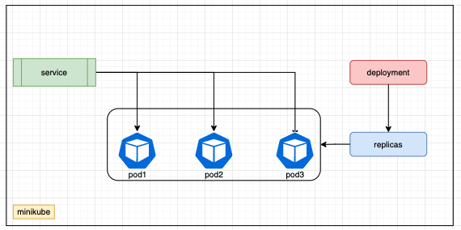

### Demo loadbalancer
 

For testing loadbalancer, i write $HOSTNAME to html file

### Deployment
- `kubectl apply -f .`
- expose service: `minikube tunnel` & access load balancer by `EXTERNAL-IP`
### Testing
```sh
sh-3.2$ kubectl get pods
NAME                     READY   STATUS    RESTARTS   AGE
nginx-55f88444bb-gw8rx   1/1     Running   0          68s
nginx-55f88444bb-lzxl6   1/1     Running   0          68s
nginx-55f88444bb-x9wcq   1/1     Running   0          68s
```
  
```bash
sh-3.2$ ./load-test.sh 
nginx-55f88444bb-lzxl6
nginx-55f88444bb-x9wcq
nginx-55f88444bb-lzxl6
nginx-55f88444bb-gw8rx
nginx-55f88444bb-gw8rx
nginx-55f88444bb-lzxl6
nginx-55f88444bb-lzxl6
nginx-55f88444bb-x9wcq
nginx-55f88444bb-x9wcq
nginx-55f88444bb-lzxl6
```
👆 all pods are forwarded

### destroy
```sh
sh-3.2$ kubectl delete -f .
service "nginx-lb" deleted
deployment.apps "nginx" deleted
```